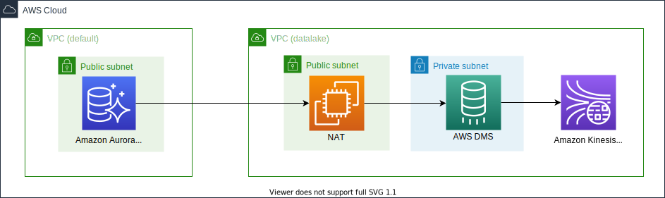

# Amazon Data Migration Service(DMS) with multiple VPCs

This repository provides you cdk scripts and sample code on how to implement end to end pipeline for replicating transactional data from MySQL DB to Amazon OpenSearch Service through Amazon Kinesis using Amazon Data Migration Service(DMS).

## Architecture

Below diagram shows what we are implementing.



:warning:
<font color=red><em>For testing easily, Aurora MySQL is provisioned in a public subnet. However, in production environment, you should provison the Aurora MySQL in a private subnet.</em></font>

The `cdk.json` file tells the CDK Toolkit how to execute your app.

This project is set up like a standard Python project.  The initialization
process also creates a virtualenv within this project, stored under the `.venv`
directory.  To create the virtualenv it assumes that there is a `python3`
(or `python` for Windows) executable in your path with access to the `venv`
package. If for any reason the automatic creation of the virtualenv fails,
you can create the virtualenv manually.

## Creating a new VPC

To manually create a virtualenv on MacOS and Linux:

```
$ cd datalake-vpc
$ python3 -m venv .venv
```

After the init process completes and the virtualenv is created, you can use the following
step to activate your virtualenv.

```
$ source .venv/bin/activate
```

If you are a Windows platform, you would activate the virtualenv like this:

```
% .venv\Scripts\activate.bat
```

Once the virtualenv is activated, you can install the required dependencies.

```
(.venv) $ pip install -r requirements.txt
```

To add additional dependencies, for example other CDK libraries, just add
them to your `setup.py` file and rerun the `pip install -r requirements.txt`
command.

At this point you can now synthesize the CloudFormation template for this code.

   <pre>
   (.venv) $ export CDK_DEFAULT_ACCOUNT=$(aws sts get-caller-identity --query Account --output text)
   (.venv) $ export CDK_DEFAULT_REGION=<i>region-name</i>
   (.venv) $ cdk deploy --require-approval \
                 DataLakeVPC
   </pre>

Let's get NAT gateway public ips from the new VPC.

   <pre>
   (.venv) $ aws ec2 describe-nat-gateways --region <i>region-name</i> --filter Name=vpc-id,Values=<i>your-vpc-id</i> | jq -r '.NatGateways | .[] | .NatGatewayAddresses | .[] | .PublicIp'
   34.xxx.xxx.xxx
   52.xxx.xxx.xxx
   </pre>


## Creating Aurora MySQL cluster

1. :information_source: Create an AWS Secret for your RDS Admin user like this:
   <pre>
   (.venv) $ cd ../source-db
   (.venv) $ pwd
   ~/aws-dms-with-multiple-vpcs/source-db
   (.venv) $ aws secretsmanager create-secret \
      --name <i>"your_db_secret_name"</i> \
      --description "<i>(Optional) description of the secret</i>" \
      --secret-string '{"username": "admin", "password": <i>"password_of_at_last_8_characters"</i>}'
   </pre>
   For example,
   <pre>
   (.venv) $ aws secretsmanager create-secret \
      --name "dev/rds/admin" \
      --description "admin user for rds" \
      --secret-string '{"username": "admin", "password": <i>"your admin password"</i>}'
   </pre>

2. Create an Aurora MySQL Cluster
   <pre>
   (.venv) $ pwd
   ~/aws-dms-with-multiple-vpcs/source-db
   (.venv) $ pip install -r requirements.txt
   (.venv) $ cdk deploy \
                 -c vpc_name='<i>your-existing-vpc-name</i>' \
                 -c db_secret_name='<i>db-secret-name</i>' \
                 -c db_cluster_name='<i>db-cluster-name</i>' \
                 -c db_access_allowed_ip_list=<i>NAT-Public-IPs</i>
                 DmsSourceDbStack
   </pre>

## Confirm that binary logging is enabled

1. Connect to the Aurora cluster writer node.
   <pre>
    $ mysql -h<i>db-cluster-name</i>.cluster-<i>xxxxxxxxxxxx</i>.<i>region-name</i>.rds.amazonaws.com -uadmin -p
    Enter password: 
    Welcome to the MariaDB monitor.  Commands end with ; or \g.
    Your MySQL connection id is 20
    Server version: 8.0.23 Source distribution

    Copyright (c) 2000, 2018, Oracle, MariaDB Corporation Ab and others.

    Type 'help;' or '\h' for help. Type '\c' to clear the current input statement.

    MySQL [(none)]> show global variables like "log_bin";
   </pre>

2. At SQL prompt run the below command to confirm that binary logging is enabled:
   <pre>
    MySQL [(none)]> show global variables like "log_bin";
    +---------------+-------+
    | Variable_name | Value |
    +---------------+-------+
    | log_bin       | ON    |
    +---------------+-------+
    1 row in set (0.00 sec)
   </pre>

3. Also run this to AWS DMS has bin log access that is required for replication
   <pre>
    MySQL [(none)]> call mysql.rds_set_configuration('binlog retention hours', 24);
    Query OK, 0 rows affected (0.01 sec)
   </pre>

## Create a sample database and table

1. Run the below command to create the sample database named `testdb`.
   <pre>
    MySQL [(none)]> show databases;
    +--------------------+
    | Database           |
    +--------------------+
    | information_schema |
    | mysql              |
    | performance_schema |
    | sys                |
    +--------------------+
    4 rows in set (0.00 sec)

    MySQL [(none)]> create database testdb;
    Query OK, 1 row affected (0.01 sec)

    MySQL [(none)]> use testdb;
    Database changed
    MySQL [testdb]> show tables;
    Empty set (0.00 sec)
   </pre>
2. Also run this to create the sample table named `retail_trans`
   <pre>
    MySQL [testdb]> CREATE TABLE IF NOT EXISTS testdb.retail_trans (
        ->   trans_id BIGINT(20) AUTO_INCREMENT,
        ->   customer_id VARCHAR(12) NOT NULL,
        ->   event VARCHAR(10) DEFAULT NULL,
        ->   sku VARCHAR(10) NOT NULL,
        ->   amount INT DEFAULT 0,
        ->   device VARCHAR(10) DEFAULT NULL,
        ->   trans_datetime DATETIME DEFAULT CURRENT_TIMESTAMP,
        ->   PRIMARY KEY(trans_id),
        ->   KEY(trans_datetime)
        -> ) ENGINE=InnoDB AUTO_INCREMENT=0;
    Query OK, 0 rows affected, 1 warning (0.04 sec)

    MySQL [testdb]> show tables;
    +------------------+
    | Tables_in_testdb |
    +------------------+
    | retail_trans     |
    +------------------+
    1 row in set (0.00 sec)

    MySQL [testdb]> desc retail_trans;
    +----------------+-------------+------+-----+-------------------+-------------------+
    | Field          | Type        | Null | Key | Default           | Extra             |
    +----------------+-------------+------+-----+-------------------+-------------------+
    | trans_id       | bigint      | NO   | PRI | NULL              | auto_increment    |
    | customer_id    | varchar(12) | NO   |     | NULL              |                   |
    | event          | varchar(10) | YES  |     | NULL              |                   |
    | sku            | varchar(10) | NO   |     | NULL              |                   |
    | amount         | int         | YES  |     | 0                 |                   |
    | device         | varchar(10) | YES  |     | NULL              |                   |
    | trans_datetime | datetime    | YES  | MUL | CURRENT_TIMESTAMP | DEFAULT_GENERATED |
    +----------------+-------------+------+-----+-------------------+-------------------+
    7 rows in set (0.00 sec)

    MySQL [testdb]>    
   </pre>

## Create Amazon Kinesis Data Streams for AWS DMS target endpoint

  <pre>
  (.venv) $ cd ../dms-to-kinesis
  (.venv) $ pwd
  ~/aws-dms-with-multiple-vpcs/dms-to-kinesis
  (.venv) $ pip install -r requirements.txt
  (.venv) $ cdk deploy \
                -c vpc_name='<i>your-existing-vpc-name</i>' \
                -c db_secret_name='<i>db-secret-name</i>' \
                -e DMSTargetKinesisDataStreamStack \
                --parameters TargetKinesisStreamName=<i>your-kinesis-stream-name</i>
  </pre>

## Create AWS DMS Replication Task
  For example, we already created the sample database (i.e. `testdb`) and table (`retail_trans`)
  <pre>
  (.venv) $ cdk deploy \
                -c vpc_name='<i>your-existing-vpc-name</i>' \
                -c db_secret_name='<i>db-secret-name</i>' \
                -e DMSAuroraMysqlToKinesisStack \
                --parameters SourceDatabaseName=<i>testdb</i> \
                --parameters SourceTableName=<i>retail_trans</i>
  </pre>

## Run Test

Start the DMS Replication task by replacing the ARN in below command.
   <pre>
   (.venv) $ aws dms start-replication-task --replication-task-arn <i>dms-task-arn</i> --start-replication-task-type start-replication
   </pre>


## Clean Up

1. Stop the DMS Replication task by replacing the ARN in below command.
   <pre>
   (.venv) $ aws dms stop-replication-task --replication-task-arn <i>dms-task-arn</i>
   </pre>

2. Delete the CloudFormation stack by running the below command.
   <pre>
   (.venv) $ pwd
   ~/aws-dms-with-multiple-vpcs/dms-to-kinesis
   (.venv) $ cdk destroy
   </pre>

## Useful commands

 * `cdk ls`          list all stacks in the app
 * `cdk synth`       emits the synthesized CloudFormation template
 * `cdk deploy`      deploy this stack to your default AWS account/region
 * `cdk diff`        compare deployed stack with current state
 * `cdk docs`        open CDK documentation

Enjoy!

## References

 * [aws-dms-deployment-using-aws-cdk](https://github.com/aws-samples/aws-dms-deployment-using-aws-cdk) - AWS DMS deployment using AWS CDK (Python)
 * [aws-dms-msk-demo](https://github.com/aws-samples/aws-dms-msk-demo) - Streaming Data to Amazon MSK via AWS DMS
 * [How to troubleshoot binary logging errors that I received when using AWS DMS with Aurora MySQL as the source?(Last updated: 2019-10-01)](https://aws.amazon.com/premiumsupport/knowledge-center/dms-binary-logging-aurora-mysql/)
 * [AWS DMS - Using Amazon Kinesis Data Streams as a target for AWS Database Migration Service](https://docs.aws.amazon.com/dms/latest/userguide/CHAP_Target.Kinesis.html)
 * [Specifying task settings for AWS Database Migration Service tasks](https://docs.aws.amazon.com/dms/latest/userguide/CHAP_Tasks.CustomizingTasks.TaskSettings.html#CHAP_Tasks.CustomizingTasks.TaskSettings.Example)
 * [Windows SSH / Tunnel for Kibana Instructions - Amazon Elasticsearch Service](https://search-sa-log-solutions.s3-us-east-2.amazonaws.com/logstash/docs/Kibana_Proxy_SSH_Tunneling_Windows.pdf)
 * [Use an SSH Tunnel to access Kibana within an AWS VPC with PuTTy on Windows](https://amazonmsk-labs.workshop.aws/en/mskkdaflinklab/createesdashboard.html)
 * [OpenSearch Popular APIs](https://opensearch.org/docs/latest/opensearch/popular-api/)

## Security

See [CONTRIBUTING](CONTRIBUTING.md#security-issue-notifications) for more information.

## License

This library is licensed under the MIT-0 License. See the LICENSE file.

